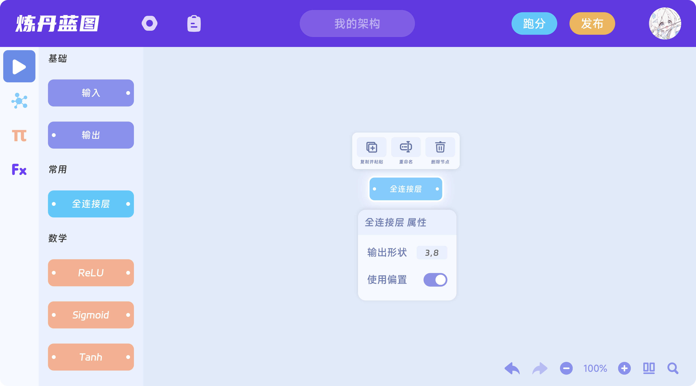

<div align="center">


# 炼丹蓝图·前端

**AI 模型架构可视化设计工具**

像搭积木一样构建和理解复杂 AI 模型架构

[](https://www.gnu.org/licenses/agpl-3.0)


</div>

---

## 📖 简介

**炼丹蓝图 (AI Blueprint)** 是一个专为 AI 模型设计者打造的蓝图式可视化工具。

旨在降低模型设计的门槛，通过直观的节点拖拽和连线，帮助你快速构建、实验和理解复杂的神经网络架构。无论你是刚刚入门的 AI 爱好者，还是经验丰富的算法工程师，它都能让抽象的代码逻辑变得触手可及。

## 🚧 当前状态

> **【早期开发阶段】**
>
> 🚀 **核心功能已跑通**：编辑器基础框架已完成，支持节点的自由创建、连接、参数配置及持久化。
>
> ⚠️ **待完善**：目前的算子节点种类尚不丰富，部分高级 AI 组件待实现。
>
> 🤝 **我们需要你的帮助！** 诚邀社区贡献更多的节点定义、功能特性及创意想法。

## 📸 界面设计

<div align="center">
  
  <br/><br/>
  
</div>

## 🚀 快速开始

本项目前端基于 **React** + **Vite** 构建，推荐使用 **Bun** 或 **npm** 管理依赖。

### 1. 获取代码

```bash
git clone https://github.com/ai-blueprint/front.git
cd front
```

### 2. 安装依赖

```bash
# 使用 Bun (推荐)
bun install

# 或者使用 npm
npm install
```

### 3. 启动开发服务器

```bash
# 使用 Bun
bun dev

# 或者使用 npm
npm run dev
```

启动后，浏览器访问终端显示的地址（默认 `http://localhost:5173`）即可体验。

## 📄 许可证

本项目采用 **GNU AGPL v3** 许可证。

- ✅ **欢迎贡献**：我们鼓励大家共同完善这个工具。
- ⚠️ **商业使用注意**：如果您在商业项目中使用本项目的源码，请务必遵守 AGPLv3 协议的开源义务（即您的修改也必须开源）。
- 💼 **闭源商业授权**：如需在闭源商业产品中使用，请联系我们获取商业授权。

## 🤝 贡献方式

我们 **强烈鼓励** 通过 **Pull Request** 向本仓库贡献代码！

无论是修复 Bug、增加新节点、优化 UI 还是完善文档，您的每一次提交都让炼丹蓝图变得更好。请尽量直接向本仓库提交 PR，避免社区分裂。

## 📞 社区与联系

有问题或建议？欢迎加入社区交流：

- **QQ 交流群**：[1081197052](https://qun.qq.com/universal-share/share?ac=1&authKey=eLkj1QLdUkC2LQAiLKW2tmH87UgnLxrp22jPc0q4vlCPVy84SOSYOR3coq8pNZuB&busi_data=eyJncm91cENvZGUiOiIxMDgxMTk3MDUyIiwidG9rZW4iOiJVbzB3dmJQNVl0cnozaFpKQmYycStPa2k3TEd2ZytIVTRENklkSHptcHhPU1JHK203QzgyNHhOcE9KSldhd1Q2IiwidWluIjoiOTE3ODExNzI2In0%3D&data=zyq7dImFnIpdAx5x2Zs8oKjKC8DAvkepKvOczDGKaOPHRi7YJGAcrwXq-3upjpICMZ1hK13zJ1UT9bzdTO8WpA&svctype=4&tempid=h5_group_info)

---

<div align="center">
  <sub>Made with ❤️ for the AI Community</sub>
</div>
